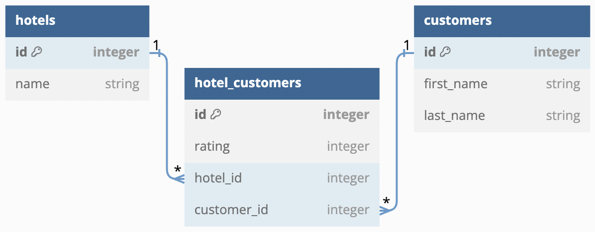

# Flask Mock Challenge - Hotel Customers

For this Mock Code Challenge, you'll be working with a Hotel Customer domain.

In this repo:

- There is a Flask application with some features built out.
- There are tests included which you can run using `pytest -x`.

Depending on your preference, you can either check your API by:

- Using Postman to make requests
- Running `pytest -x` and seeing if your code passes the tests

## Setup

The instructions assume you changed into the `code-challenge` folder **prior** to opening the code editor.

To download the dependencies for the backend, run:

```console
pipenv install
pipenv shell
```

You can run your Flask API on [`localhost:5555`](http://localhost:5555) by running:

```console
python server/app.py
```

Your job is to build out the Flask API to add the functionality described in the deliverables below.

## Models

You will implement an API for the following data model:



The file `server/models.py` defines the model classes **without relationships**. Use the following commands to create the initial database `app.db`:

```console
export FLASK_APP=server/app.py
flask db init
flask db upgrade head
```

Now you can implement the relationships as shown in the ER diagram:

- A `Hotel` has many `Customer`s through `HotelCustomer`
- A `Customer` has many `Hotel`s through `HotelCustomer`
- A `HotelCustomer` belongs to a `Hotel` and belongs to a `Customer`

Update `server/models.py` to establish the model relationships. Since a `HotelCustomer` belongs to a `Hotel` and a `Customer`, configure the model to cascade deletes.

Set serialization rules to limit the recursion depth.

Run the migrations and seed the database:

```console
flask db revision --autogenerate -m 'message'
flask db upgrade head
python server/seed.py
```

> If you aren't able to get the provided seed file working, you are welcome to generate your own seed data to test the application.

## Validations

Add validations to the `HotelCustomer` model:

- must have a `rating` between 1 and 5

## Routes

Set up the following routes. Make sure to return JSON data in the format specified along with the appropriate HTTP verb.

Recall you can specify fields to include or exclude when serializing a model instance to a dictionary using to_dict() (don't forget the comma if specifying a single field).

NOTE: If you choose to implement a Flask-RESTful app, you need to add code to instantiate the `Api` class in server/app.py.

### GET /hotels

Return JSON data in the format below:

```json
[
    {
        "id": 1,
        "name": "Marriott Hotel"
    },
    {
        "id": 2,
        "name": "Hampton Inn"
    }
]
```

Recall you can specify fields to include or exclude when serializing a model instance to a dictionary using `to_dict()` (don't forget the comma if specifying a single field).

### GET /hotels/<int:id>

If the `Hotel` exists, return JSON data in the format below:

```json
{
    "id": 1,
    "name": "Marriott Hotel",
    "hotel_customers": [
        {
            "id": 1,
            "rating": 5,
            "hotel_id": 1,
            "customer_id": 1,
            "customer": {
                "id": 1,
                "first_name": "Alice",
                "last_name": "Baker"
            }
        }
    ]
}
```

If the `Hotel` does not exist, return the following JSON data, along with the appropriate HTTP status code:

```json
{
    "error": "Hotel not found"
}
```

### DELETE /hotels/<int:id>

If the `Hotel` exists, it should be removed from the database, along with any `HotelCustomer`s that are associated with it (a `HotelCustomer` belongs to a `Hotel`). If you did not set up your models to cascade deletes, you need to delete associated `HotelCustomer`s before the `Hotel` can be deleted.

After deleting the `Hotel`, return an _empty_ response body, along with the appropriate HTTP status code.

If the `Hotel` does not exist, return the following JSON data, along with the appropriate HTTP status code:

```json
{
    "error": "Hotel not found"
}
```

### GET /customers

Return JSON data in the format below:

```json
[
    {
        "id": 1,
        "first_name": "Alice",
        "last_name": "Baker"
    },
    {
        "id": 2,
        "first_name": "Bob",
        "last_name": "Smith"
    }
]
```

### POST /hotel_customers

This route should create a new `HotelCustomer` that is associated with an existing `Hotel` and `Customer`. It should accept an object with the following properties in the body of the request:

```json
{
    "rating": 5,
    "hotel_id": 1,
    "customer_id": 2
}
```

If the `HotelCustomer` is created successfully, send back a response with the data related to the `RestaurantPizza`:

```json
{
    "id": 7,
    "rating": 5,
    "hotel_id": 1,
    "customer_id": 2,
    "hotel": {
        "id": 1,
        "name": "Marriott"
    },
    "customer": {
        "id": 2,
        "first_name": "Bob",
        "last_name": "Smith"
    }
}
```

If the `HotelCustomer` is **not** created successfully due to a validation error, return the following JSON data, along with the appropriate HTTP status code:

```json
{
    "errors": ["validation errors"]
}
```